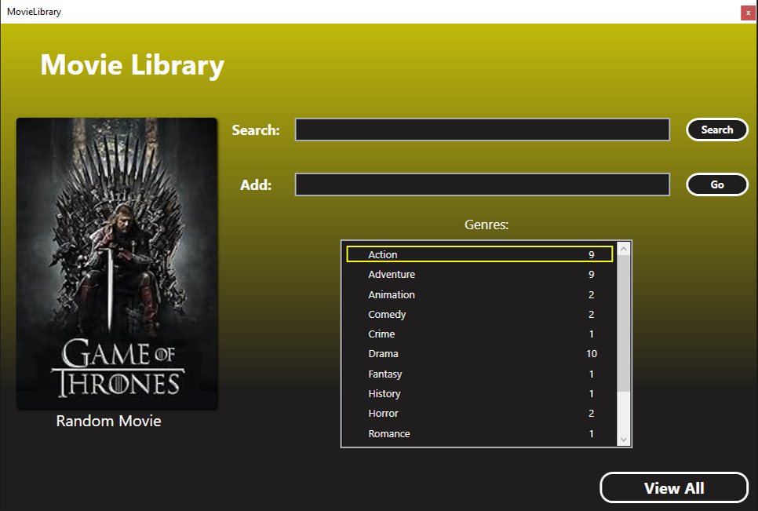
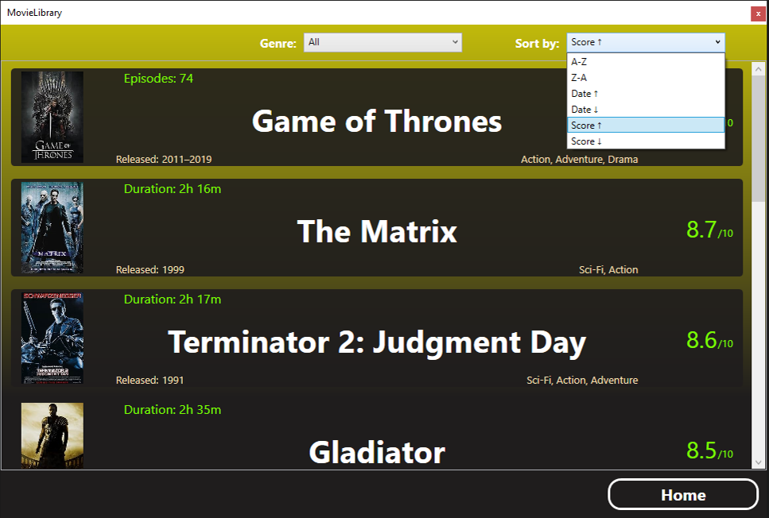
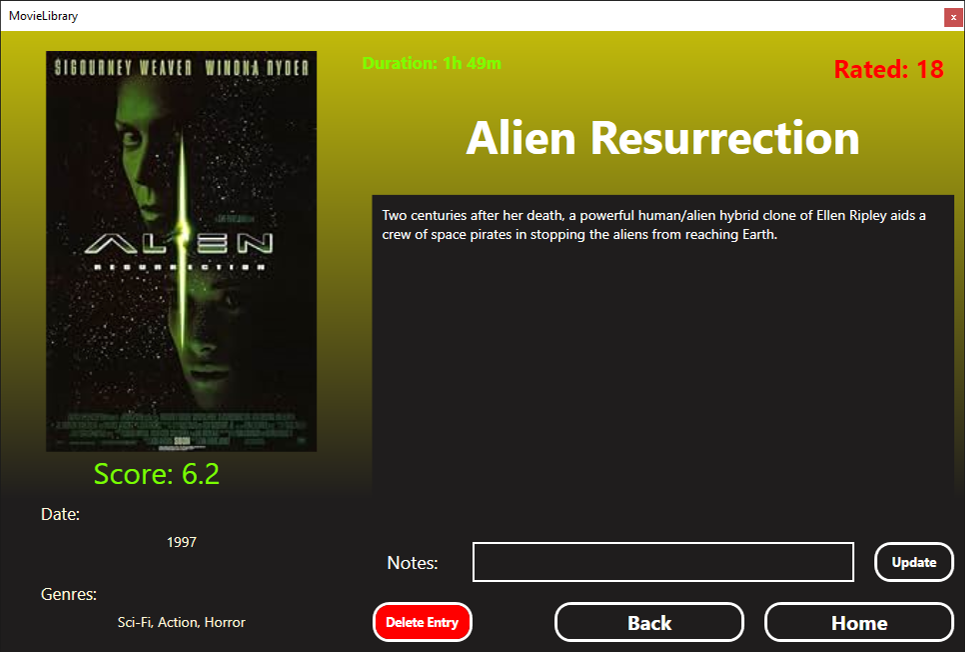
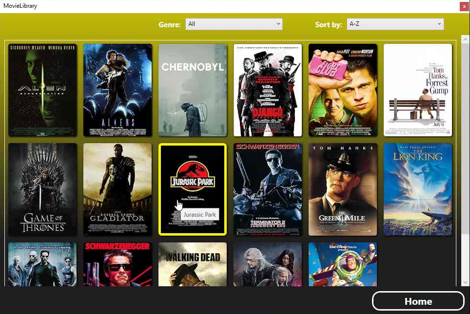

# MovieLibrary

### Description

This is a C# WPF application that uses web scraping to allow the user to create an off-line database of movie entries via the IMDb website. The user can paste the URL of a film's page into the 'Add' textbox (as seen below in the first screenshot) to scrape the information from the page and add it to the database.

It is an updated version of an old WinForms project that I used as the starting point for exploring WPF, MVVM (Model-View-ViewModel) architecture, dependency injection and ORM (object-relational mapping) which replaces the use of SQL in the previous version.

### Screenshots

  
  &nbsp; &nbsp; &nbsp; &nbsp;
  

  
  &nbsp; &nbsp; &nbsp; &nbsp;
  

*Screenshot 1). The home page.*

*Screenshot 2). The search results page.*

*Screenshot 3). The view entry page, allows the user to view an entry in detail and also delete and add notes to an entry.*

*Screenshot 4). The view all page, providing tiles for all stored entries and the ability to sort and filter them.*

(*full size images can be found [here](./screenshots)*)

### What was learnt

This project was an opportunity to learn more about WPF and using MVVM architecture. It also was an opportunity to learn about using ORM and dependency injection.

### Application instructions

Xpaths for the individual pieces of data on IMDb pages can be found in the 'App.config' file. If updates to IMDb alter web page structure they can be altered there. The following instructions will be grouped into four sections corresponding to the four pages of the application (as can be seen in the screenshots above). 

##### Home page

This is where the application starts (screenshot 1). Here the user can:
- Press the 'View All' button to go to the View all page.
- Select the displayed random entry to view to it with the view entry page.
- Select a genre from the 'Genres' box (this contains all the genres for all currently stored entries and the counts) which takes the user to the search results page, displaying all entries that correspond to the selected genre.
- Search for an entry/entries using the search textbox.
- Add an entry to the database using the add textbox. Pasting the URL of a movie's page on IMDb such as 'https://www.imdb.com/title/tt0110357/?ref_=nv_sr_srsg_0_tt_8_nm_0_q_lion%2520king' and pressing 'Enter' or the 'Go' button will scrape and save the information from the page and display the entry with the view entry page.

##### Search results page

This page (screenshot 2) displays the results of a search or genre selection. Clicking on a result will take the user to the view entry page and display that result. The dropdown box at the top right allows the user to sort the results alphabetically, by score, or by date of release. The dropdown in the center allows the user to filter the results by genre.

##### View entry page

This page (screenshot 3) displays all the collected information for a selected entry. It also allows the deletion of an entry and the adding of notes. To add a note enter the desired text in the 'Note' textbox and press the update button to save the changes.

##### View all page

This page displays all currently stored entries as tiles (as seen in screenshot 4). Clicking a tile will allow the user to view the entry in the view entry page. The dropdown box at the top right allows the user to sort the results alphabetically, by score, or by date of release. The dropdown in the center allows the user to filter entries by genre.

### How to use
- Clone the repository.
- Find the 'MovieLibrary.sln' file and open the project with Microsoft Visual Studio.
- Press the play button to build and run the application.
- Initially the application will be empty but entries can be added via the 'add' textbox on the home page as described above to fill the database with data.

### Requirements:
 - C# support
 - .NETFramework, Version= .NET 8.0
 - Microsoft Visual Studio 2022. This application will be runnable with alternative IDEs, such as Visual Studio Code, or via terminal but has been written and tested using Microsoft Visual Studio so instructions are centered around this.
 - NuGet package - HtmlAgilityPack (version 1.11.61)
 - NuGet package - Microsoft.EntityFrameworkCore (version 8.0.4)
 - NuGet package - Microsoft.EntityFrameworkCore.Tools (version 8.0.4)
 - NuGet package - Microsoft.EntityFrameworkCore.Sqlite (version 8.0.4)
 - NuGet package - Microsoft.Extensions.Hosting (version 8.0.0)

### License
This is a demonstration project and not intended for collaboration, as such a license has not been added so the default copyright laws apply.
